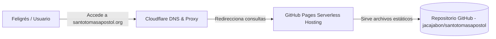

# Sitio Web Oficial - Parroquia Santo Tomás Apóstol

Este repositorio contiene el código fuente del sitio web oficial de la **Parroquia Santo Tomás Apóstol**, ubicada en Santo Tomás Milpas Altas, Sacatepéquez, Guatemala. El sitio está diseñado para proporcionar información comunitaria, horarios de misas, sacramentos, y coordinar el apoyo para el gran proyecto de reconstrucción del techo y la nueva cúpula del templo.

---

## 🚀 Arquitectura Tecnológica (Tech Stack)

El sitio ha sido desarrollado bajo principios de **desarrollo web moderno, ligereza y rendimiento óptimo**, evitando el uso de librerías o frameworks pesados (cero dependencias externas):

*   **Estructura**: `HTML5` semántico con optimización SEO integrada (metaetiquetas de descripción, jerarquía de encabezados única y accesibilidad mejorada).
*   **Estilos (CSS)**: `CSS3` nativo estructurado mediante variables personalizadas (sistema de diseño con tokens de color, sombras y radios), Flexbox y CSS Grid para un diseño responsivo adaptado a todos los dispositivos móviles, tabletas y ordenadores.
*   **Interactividad (JS)**: Código JavaScript vainilla (`Vanilla JS`) ligero encargado de:
    *   Navegación pegajosa (Sticky Header) con ocultación inteligente al hacer scroll hacia abajo.
    *   Menú móvil responsivo (Drawer) construido sobre la API nativa de Popover del navegador.
    *   Animaciones de aparición progresiva al hacer scroll (`IntersectionObserver` para la clase `.reveal`).
    *   Barra de progreso de donación animada dinámicamente según la meta.
    *   Galería interactiva con pestañas para Renders, Trabajos Actuales y Daños del Templo.
    *   Visualizador a pantalla completa (Lightbox) personalizado para ampliar las fotografías del proyecto.
    *   Acordeón dinámico con cálculo automático de altura (`scrollHeight`) para consultar los requisitos de los Sacramentos.

---

## 🌐 Arquitectura de Despliegue e Infraestructura

El sitio web está desplegado bajo una arquitectura moderna de computación en el borde (Edge Computing) y sin servidor (Serverless), garantizando un costo de alojamiento de **$0 USD** de por vida:



### Componentes de la Infraestructura:

1.  **Registrador de Dominio (Porkbun)**:
    *   Administra la propiedad legal y renovación anual del dominio principal **`santotomasapostol.org`**.
    *   Cuenta con protección de privacidad de WHOIS gratuita.
2.  **DNS & Proxy de Seguridad (Cloudflare)**:
    *   Actúa como la primera capa de contacto (servidor DNS primario).
    *   Proporciona mitigación básica de ataques DDoS, optimización de velocidad de carga mediante caché y estadísticas de tráfico.
3.  **Servidor de Alojamiento (GitHub Pages)**:
    *   Ameba de forma gratuita el código HTML, CSS, JS e imágenes del proyecto desde la rama `main`.
    *   Genera e instala automáticamente el certificado SSL (HTTPS) de forma gratuita.

---

## 🛠️ Cómo realizar actualizaciones y desplegar cambios

Cada vez que necesites actualizar la información del sitio web (como requisitos, horarios de misas o fotos de avances), solo debes seguir este flujo de trabajo Git estándar en tu computadora:

1.  **Realizar los cambios**: Edita los archivos locales (`index.html`, `css/styles.css` o `js/main.js`).
2.  **Probar localmente**: Abre el archivo `index.html` en cualquier navegador para verificar el resultado.
3.  **Subir cambios a GitHub**:
    Abre tu terminal en la carpeta del proyecto y ejecuta:
    ```bash
    # 1. Agrega todos los archivos modificados
    git add .

    # 2. Crea un punto de restauración con una descripción de tu cambio
    git commit -m "Actualizar horarios de misa de domingo"

    # 3. Empuja los cambios a internet
    git push origin main
    ```

4.  **Despliegue Automático**: En menos de 60 segundos, los servidores de GitHub Pages detectarán el cambio en la rama `main`, reconstruirán el sitio y lo publicarán automáticamente en **`https://santotomasapostol.org`**. No es necesario realizar configuraciones adicionales.
